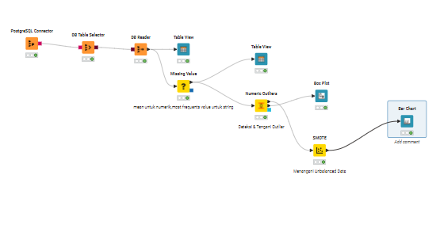
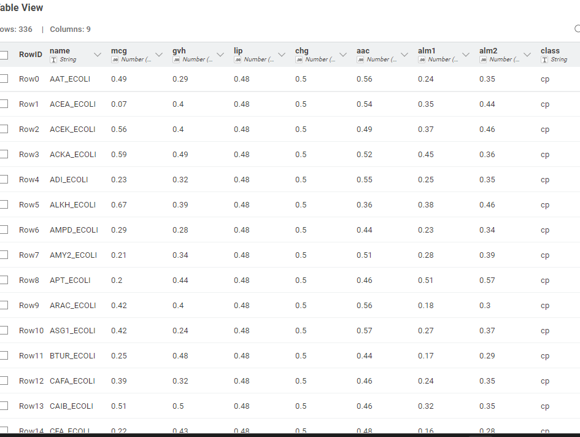
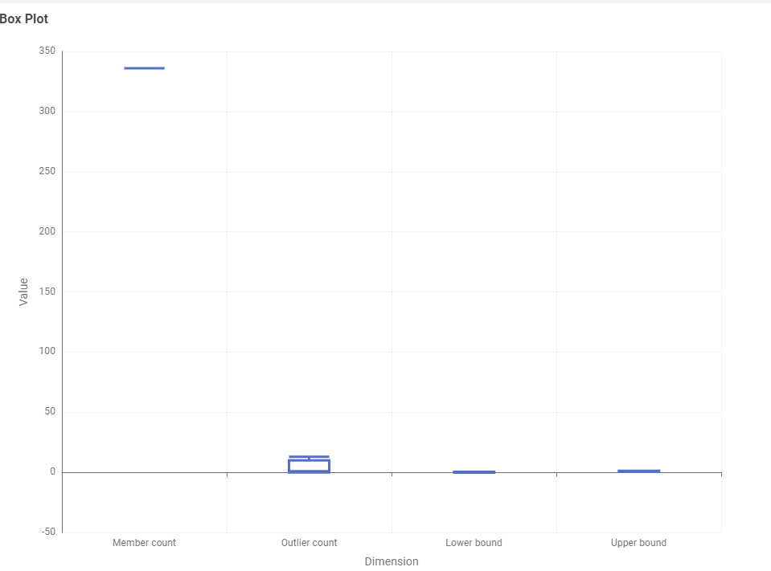
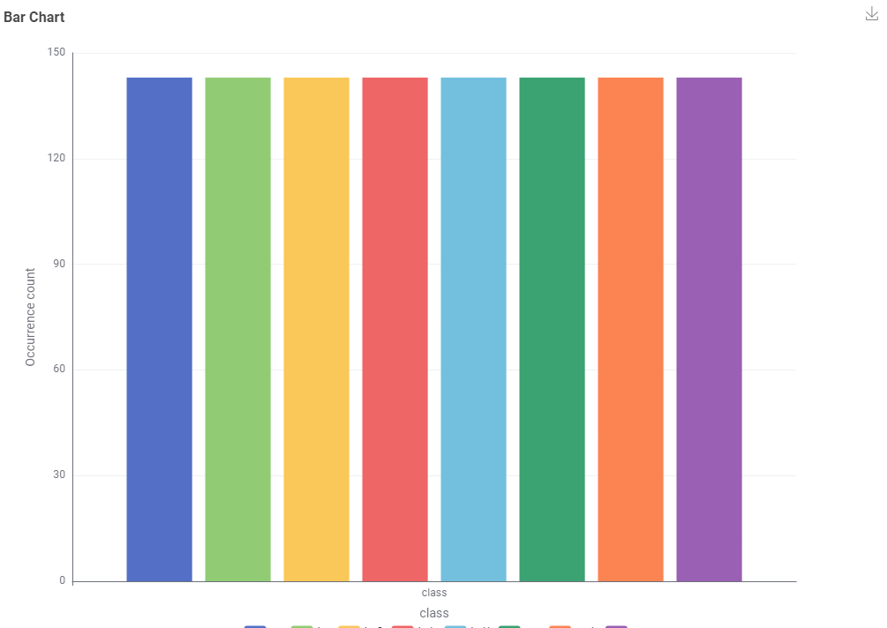

# 📊 Alur Eksperimen Klasifikasi Naive Bayes dengan KNIME

Workflow ini digunakan untuk melakukan menangani missing value,Deteksi outlier dan balancing data mengggunakan SMOTE dan dengan tahapan mulai dari koneksi database, pembersihan data, penanganan outlier, penyeimbangan data (SMOTE), hingga evaluasi model.

---

## ⚙️ 1. PostgreSQL Connector
**Fungsi:**  
Menghubungkan KNIME dengan database PostgreSQL yang berisi dataset penyakit ginjal.

**Keterangan:**  
- Node ini digunakan agar data dapat langsung diambil dari database tanpa perlu ekspor ke CSV.  
- Parameter koneksi mencakup: host, port, nama database, username, dan password.

---

## 📑 2. DB Table Selector
**Fungsi:**  
Memilih tabel tertentu dari database PostgreSQL yang akan digunakan.

**Keterangan:**  
- Pastikan memilih tabel yang berisi data utama, misalnya tabel `ckd_data`.  
- Node ini memastikan hanya data relevan yang diteruskan ke proses selanjutnya.

---

## 🧾 3. DB Reader
**Fungsi:**  
Menarik (membaca) data dari database PostgreSQL ke dalam workflow KNIME.

**Keterangan:**  
- Mengubah data dari format database menjadi tabel KNIME yang bisa diproses lebih lanjut.  
- Hasilnya dapat dilihat dengan node **Table View**.

---

## 👀 4. Table View
**Fungsi:**  
Menampilkan isi tabel yang telah dibaca dari database.

**Keterangan:**  
- Memastikan data sudah masuk dengan benar sebelum melanjutkan ke tahap preprocessing.  
- Digunakan untuk melakukan inspeksi awal terhadap data.

### Visualisasi Tabel sebelum penanganan missing value

---

## 🧩 5. Missing Value
**Fungsi:**  
Menangani nilai-nilai yang hilang (missing values) dalam dataset.

**Keterangan:**  
- Untuk kolom numerik → gunakan metode **Mean**.  
- Untuk kolom kategorik → gunakan metode **Most frequent value**.  
- Langkah ini penting agar model tidak gagal akibat adanya nilai kosong.

### Visualisasi Tabel setelah penanganan missing value

---

## 📈 6. Numeric Outliers
**Fungsi:**  
Mendeteksi nilai-nilai ekstrim (outlier) pada kolom numerik.

**Keterangan:**  
- Node ini membantu mengidentifikasi data yang menyimpang dari distribusi umum.  
- Hasilnya bisa divisualisasikan dengan **Box Plot**.

### Visualisasi box plot setelah deteksi outlier

---

## 📊 7. Box Plot
**Fungsi:**  
Menampilkan distribusi data dan mendeteksi outlier secara visual.

**Keterangan:**  
- Kotak menunjukkan interquartile range (IQR).  
- Titik di luar whiskers menunjukkan potensi outlier.

---

## 🧹 8. SMOTE
**Fungsi:**  
Menangani ketidakseimbangan kelas (imbalanced dataset).

**Keterangan:**  
- SMOTE (Synthetic Minority Oversampling Technique) menghasilkan data sintetis untuk kelas minoritas.  
- Dengan ini, model tidak bias terhadap kelas mayoritas.  
- Node ini ditempatkan setelah data bersih dan bebas outlier.

### Visualisasi bar chart setelah balancing data menggunakan SMOTE

---

## 💡 Alur Lengkap Workflow
1. PostgreSQL Connector  
2. DB Table Selector  
3. DB Reader  
4. Table View  
5. Missing Value  
6. Numeric Outliers → Box Plot  
7. SMOTE (menangani unbalanced data)  → bar chart

---
