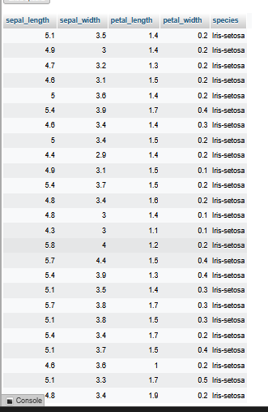

# Data Understanding

Pada bagian ini, saya melakukan pemahaman awal terhadap dataset **Iris** yang digunakan dalam proyek ini. Dataset diambil dari Kaggle, lalu disimpan pada database **MySQL** dan **PostgreSQL**.

---

## Struktur Data

Jumlah baris:  
Jumlah kolom:  

Daftar kolom dan tipe data:

### MySQL
| Kolom        | Tipe Data SQL | Tipe Analisis |
|--------------|---------------|---------------|
| sepal_length | FLOAT         | Numerikal     |
| sepal_width  | FLOAT         | Numerikal     |
| petal_length | FLOAT         | Numerikal     |
| petal_width  | FLOAT         | Numerikal     |
| species      | VARCHAR(50)   | Kategorikal   |

---

### PostgreSQL
| Kolom        | Tipe Data SQL    | Tipe Analisis |
|--------------|-----------------|---------------|
| sepal_length | DOUBLE PRECISION| Numerikal     |
| sepal_width  | DOUBLE PRECISION| Numerikal     |
| petal_length | DOUBLE PRECISION| Numerikal     |
| petal_width  | DOUBLE PRECISION| Numerikal     |
| species      | TEXT            | Kategorikal   |

---

## Kualitas Data

- **Missing Values:**
  
  - **Missing Values:** Tidak ditemukan missing values pada dataset Iris (semua kolom terisi penuh).

- **Duplicate Rows:**
  
 - **Duplicate Rows:** Tidak ditemukan baris duplikat pada dataset.

- **Catatan Outlier:**
     
  **Deteksi Outlier**

Untuk mendeteksi outlier, dibuat scatter chart dengan kombinasi variabel numerikal:

1. Sepal length vs sepal width  
   - Titik data dari ketiga spesies menyebar rapat.  
   - Tidak ditemukan nilai yang menyendiri jauh dari kelompok → tidak ada outlier ekstrim.  

2. Petal length vs petal width  
   - Terlihat bahwa Iris-setosa membentuk kluster terpisah dengan ukuran kelopak lebih kecil.  
   - Hal ini bukan outlier kesalahan data, melainkan perbedaan alami antar spesies.  

Dengan demikian, tidak ada data yang perlu dihapus karena outlier pada dataset ini merupakan bagian dari variasi kelas.

---

## Distribusi Awal

- Distribusi kategori:  
  (contoh: jumlah tiap spesies)

- Rentang nilai numerikal:  
  (contoh: min–max per kolom)

---

## Ringkasan

(Tuliskan kesimpulan singkat dari hasil Data Understanding)

