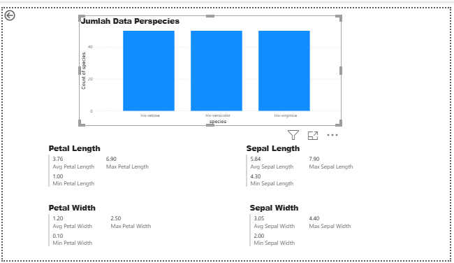

# Eksplorasi Data

Setelah memahami struktur dataset, langkah berikutnya adalah melakukan eksplorasi data untuk mendapatkan wawasan lebih dalam mengenai pola dan karakteristik data.

---

## Statistik Deskriptif

(Tampilkan nilai min, max, mean, median, standar deviasi, dsb.)

---

## Deteksi Outlier

(Gunakan boxplot atau metode lain untuk menampilkan potensi outlier)

---

## Visualisasi

Eksplorasi dilakukan menggunakan **Power BI** dengan fokus pada:

- Nilai minimum dan maksimum setiap kolom  
- Nilai rata-rata setiap kolom  
- Distribusi jumlah tiap kelas (ditampilkan dalam grafik batang)  

### Hasil Visualisasi
- MySQL  
  

- PostgreSQL  
  

---

## Insight Awal

(Tuliskan poin-poin hasil pengamatan dari eksplorasi data, misalnya perbedaan karakteristik antar spesies)

---

## Ringkasan

(Tuliskan kesimpulan dari eksplorasi data)
