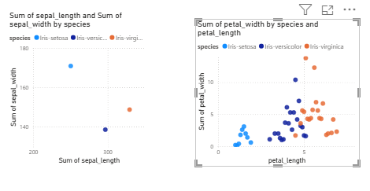

# Eksplorasi Data

Setelah memahami struktur dataset, langkah berikutnya adalah melakukan eksplorasi data untuk mendapatkan wawasan lebih dalam mengenai pola dan karakteristik data.

---

## Statistik Deskriptif

 

## Deteksi Outlier

 

Untuk mendeteksi outlier, dibuat scatter chart dengan kombinasi variabel numerikal:

1. Sepal length vs sepal width  
   - Titik data dari ketiga spesies menyebar rapat.  
   - Tidak ditemukan nilai yang menyendiri jauh dari kelompok → tidak ada outlier ekstrim.  

2. Petal length vs petal width  
   - Terlihat bahwa Iris-setosa membentuk kluster terpisah dengan ukuran kelopak lebih kecil.  
   - Hal ini bukan outlier kesalahan data, melainkan perbedaan alami antar spesies.  

Dengan demikian, tidak ada data yang perlu dihapus karena outlier pada dataset ini merupakan bagian dari variasi kelas.

## Visualisasi

Eksplorasi dilakukan menggunakan **Power BI** dengan fokus pada:

- Nilai minimum dan maksimum setiap kolom  
- Nilai rata-rata setiap kolom  
- Distribusi jumlah tiap kelas (ditampilkan dalam grafik batang)  

### Hasil Visualisasi
- MySQL  
  

- PostgreSQL  
  

---

## Insight Awal

1. **Jumlah Data**  
   - Dataset terdiri dari 150 baris dan 5 kolom (4 numerikal, 1 kategorikal).  
   - Setiap kelas spesies (`Setosa`, `Versicolor`, `Virginica`) berjumlah 50 data → seimbang.  

2. **Sebaran Variabel Numerikal**  
   - `sepal_length`: rata-rata 5.84, dengan variasi moderat (std ~0.83).  
   - `sepal_width`: rata-rata 3.05, relatif sempit (std ~0.43).  
   - `petal_length`: variasi paling besar (min 1.0, max 6.9, std ~1.76).  
   - `petal_width`: juga bervariasi (min 0.1, max 2.5, std ~0.76).  

3. **Perbedaan Antar Spesies**  
   - *Iris Setosa* memiliki **petal lebih kecil** dibanding dua spesies lain → terlihat jelas pada scatter plot.  
   - *Versicolor* dan *Virginica* memiliki area yang tumpang tindih, namun Virginica cenderung lebih besar ukuran petalnya.  

4. **Outlier**  
   - Tidak ada outlier ekstrim yang menyendiri.  
   - Nilai ekstrem lebih disebabkan oleh variasi alami antar spesies, bukan kesalahan data.  

## Ringkasan

- Dataset **Iris** cocok untuk eksplorasi dasar machine learning karena sederhana namun tetap informatif.  
- Variabel **petal_length** dan **petal_width** adalah fitur paling signifikan dalam membedakan spesies.  
- Distribusi kelas seimbang (50:50:50) sehingga tidak ada masalah *class imbalance*.  
- Tidak ditemukan *missing value* maupun outlier ekstrim → dataset bersih dan siap digunakan untuk analisis lebih lanjut.  

